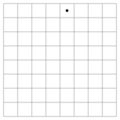
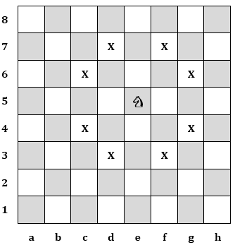

# Knight-s-Tour
Dùng d3.js vẽ hành trình của 1 quân Mã trên bàn cờ kích thước nxn
## Nguồn gốc bài toán
* Mã đi tuần (hay hành trình của quân mã) là bài toán về việc di chuyển một quân mã trên bàn cờ vua (8 x 8). 
Quân mã được đặt ở một ô trên một bàn cờ trống nó phải di chuyển theo quy tắc của cờ vua để đi qua mỗi ô trên bàn cờ đúng một lần.
Có rất nhiều lời giải cho bài toán này, chính xác là 26.534.728.821.064 lời giải trong đó quân mã có thể kết thúc tại chính ô mà nó khởi đầu.
Một hành trình như vậy được gọi là hành trình đóng. Có những hành trình, trong đó quân mã sau khi đi hết tất cả 64 ô của bàn cờ (kể cả ô xuất phát), thì từ ô cuối của hành trình không thể đi về ô xuất phát chỉ bằng một nước đi. Những hành trình như vậy được gọi là hành trình mở.
* Một hành trình của quân mã với bàn cờ 8x8 như hình vẽ dưới đây:

## Phân tích bài toán
* Cho bàn cờ có kích thước n x n (có nxn ô). Một quân mã được đặt tại ô ban đầu có toạ độ x 0 , y 0
và được phép dịch chuyển theo luật cờ thông thường. Bài toán đặt ra là từ ô ban đầu, tìm một chuỗi
các nước đi của quân mã, sao cho quân mã này đi qua tất cả các ô của bàn cờ, mỗi ô đúng 1 lần.
* Như đã nói ở trên, quá trình thử - sai ban đầu được xem xét ở mức đơn giản hơn. Cụ thể,
trong bài toán này, thay vì xem xét việc tìm kiếm chuỗi nước đi phủ khắp bàn cờ, ta xem xét vấn
đề đơn giản hơn là tìm kiếm nước đi tiếp theo của quân mã, hoặc kết luận rằng không còn nước đi
kế tiếp thỏa mãn. Tại mỗi bước, nếu có thể tìm kiếm được 1 nước đi kế tiếp, ta tiến hành ghi lại
nước đi này cùng với chuỗi các nước đi trước đó và tiếp tục quá trình tìm kiếm nước đi. Nếu tại
bước nào đó, không thể tìm nước đi kế tiếp thỏa mãn yêu cầu của bài toán, ta quay trở lại bước trước,
 hủy bỏ nước đi đã lưu lại trước đó và thử sang 1 nước đi mới. Quá trình có thể phải thử rồi
quay lại nhiều lần, cho tới khi tìm ra giải pháp hoặc đã thử hết các phương án mà không tìm ra
giải pháp.
* Đầu tiên, ta sử dụng 1 mảng 2 chiều đề mô tả bàn cờ:
Các phần tử của mảng này có kiểu dữ liệu số nguyên. Mỗi phần tử của mảng đại diện cho 1
ô của bàn cờ. Chỉ số của phần tử tương ứng với tọa độ của ô, chẳng hạn phần tử Banco[0][0]
tương ứng với ô (0,0) của bàn cờ. Giá trị của phần tử cho biết ô đó đã được quân mã đi qua hay
chưa. Nếu giá trị ô = 0 tức là quân mã chưa đi qua, ngược lại ô đã được quân mã đã đi qua.
* Các phần tử của mảng này có kiểu dữ liệu số nguyên. Mỗi phần tử của mảng đại diện cho 1
ô của bàn cờ. Chỉ số của phần tử tương ứng với tọa độ của ô, chẳng hạn phần tử Banco[0][0]
tương ứng với ô (0,0) của bàn cờ. Giá trị của phần tử cho biết ô đó đã được quân mã đi qua hay
chưa. Nếu giá trị ô = 0 tức là quân mã chưa đi qua, ngược lại ô đã được quân mã đã đi qua.
* Banco[x][y] = 0: ô (x,y) chưa được quân mã đi qua
* Banco[x][y] = i: ô (x,y) đã được quân mã đi qua tại nước thứ i.
* Nước đi kế tiếp chấp nhận được nếu nó chưa được quân mã đi qua, tức là nếu ô (u,v) được
chọn là nước đi kế tiếp thì Banco[u][v] = 0 là điều kiện để chấp nhận. Ngoài ra, hiển nhiên là ô đó
phải nằm trong bàn cờ nên 0 ≤ u, v < n.
* Việc ghi lại nước đi tức là đánh dấu rằng ô đó đã được quân mã đi qua. Tuy nhiên, ta cũng
cần biết là quân mã đi qua ô đó tại nước đi thứ mấy. Như vậy, ta cần 1 biến i để cho biết hiện tại
đang thử ở nước đi thứ mấy, và ghi lại nước đi thành công bằng cách gán giá trị Banco[u][v]=i.
* Do i tăng lên theo từng bước thử, nên ta có thể kiểm tra xem bàn cờ còn ô trống không bằng
cách kiểm tra xem i đã bằng n 2 chưa. Nếu i<n 2 tức là bàn cờ vẫn còn ô trống.
* Theo luật cờ thông thường, quân mã từ ô (x,y) có thể đi tới 8 ô trên bàn cờ như trong hình vẽ:

* Ta thấy rằng 8 ô mà quân mã có thể đi tới từ ô (x,y) có thể tính tương đối so với (x,y) là:
(x+2, y-1); (x+1, y-2); (x-1, y-2); (x-2, y-1); (x-2, y+1); (x-1, y+2); (x+1; y+2); (x+2, y+1)
* Nếu gọi dx, dy là các giá trị mà x, y lần lượt phải cộng vào để tạo thành ô mà quân mã có
thể đi tới, thì ta có thể gán cho dx, dy mảng các giá trị như sau:
* dx = {2, 1, -1, -2, -2, -1, 1, 2}
* dy = {-1, -2, -2, -1, 1, 2, 2, 1}
* Như vậy, danh sách các nước đi kế tiếp (u, v) có thể được tạo ra như sau:
u = x + dx[i]
v = y + dy[i]
* với các nước đi như trên thì (u, v) có thể là ô nằm ngoài bàn cờ. Tuy nhiên, như
đã nói ở trên, ta đã có điều kiện 0 ≤ u, v < n, do vậy luôn đảm bảo ô (u, v) được chọn là hợp lệ.

